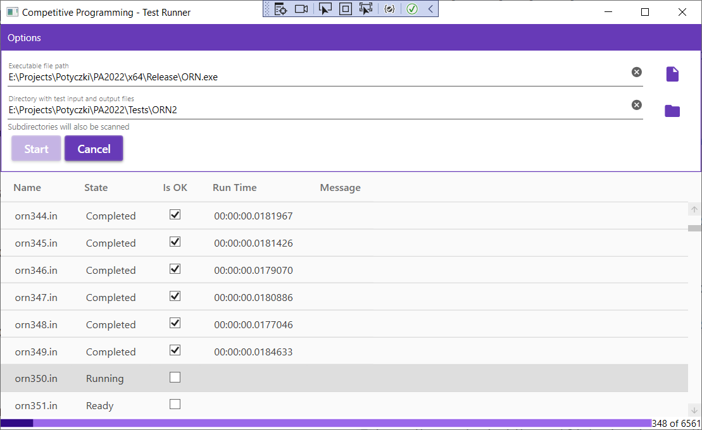
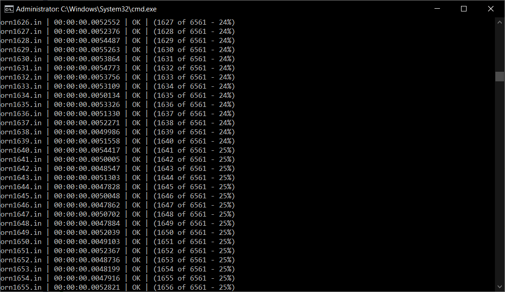

# Competetive Programming Test Runner App

This application helps testing algorithmic tasks solutions (compiled to executable file).
Tested on tasks from the following programming contests:

1. [**Potyczki algorytniczme**](https://potyczki.mimuw.edu.pl/)





## Installation Instructions

You will need to build the project to create an executable. 

### Building
In the solution directory, run this command at the command line:

#### WPF App (Windows only)
```dotnet publish TestRunner.Wpf -r win-x64 -c Release /p:PublishSingleFile=true --self-contained false```


#### Cli (Any operating system with .NET framework)
```dotnet publish TestRunner.Cli -r win-x64 -c Release /p:PublishSingleFile=true --self-contained false```

### Installation

Copy the content of the ```publish``` directory, to the desired location.


## Current features
1. Runs tests against executables that require values to be passed through standard input,
1. Compares executable output with the expected output file (matched by name),
1. Displays run time for each test case
1. Available for Windows (WPF App with GUI or Cli Console App) and Linux/Other (Cli App)

## Possible ideas
1. Add **timeout** parameter,
1. Add parallel test execution option,